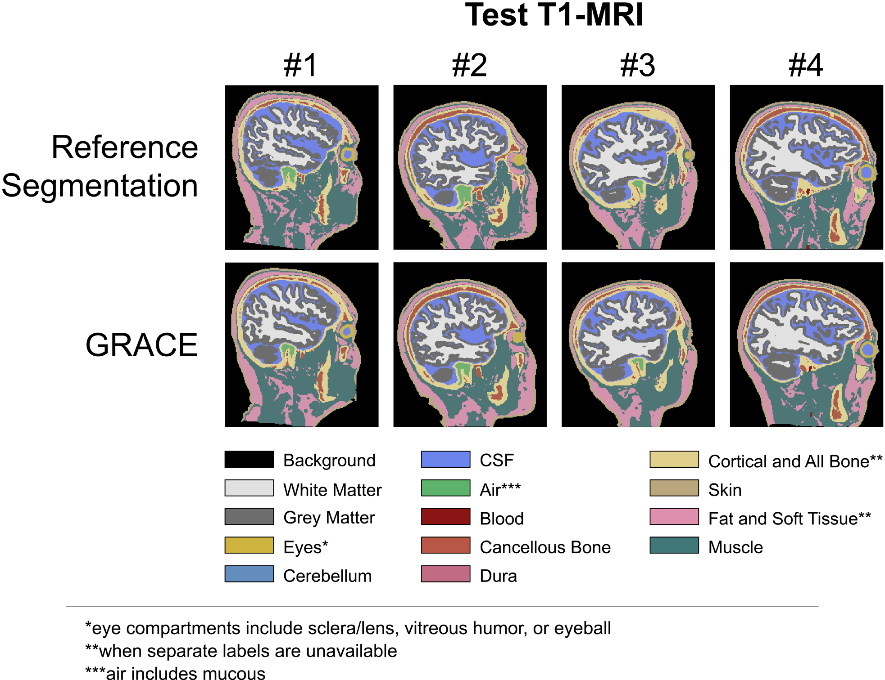

## 1. Overview
- **Toolbox Name**: General, Rapid, And Comprehensive whole-hEad tissue segmentation (GRACE)
- **Version**: v1.0.1
- **Github**: https://github.com/lab-smile/GRACE
- **Pretrained Model**: https://github.com/lab-smile/GRACE/releases/tag/v1.0.0
- **Paper**: https://doi.org/10.1162/imag_a_00090
- **Reference**: Stolte, S. E.; Indahlastari, A.; Chen, J.; Albizu, A.; Dunn, A.; Pedersen, S.; See, K. B.; Woods, A. J. & Fang, R. Precise and Rapid whole-head segmentation from Magnetic Resonance Images of older adults using deep learning
- **Purpose**: Segmentation of the whole MRI scan in older adults. 

---

## 2. Expected Performance
- **Segmentation result**: 11 tissue types including white matter, grey matter, eyes, cerebrospinal fluid, air, blood vessel, cancellous bone, cortical bone, skin, fat, and muscle. 
- **Metrics**: 
    1. Average Dice: 0.82
    2. Average Hausdorff Distance: 2.87
- **Qualitative Analysis**:


- **Time taken to segment**: about 3 seconds

---

## 3. Installation & Setup
Note: There is a prepare_dataset.py file with helper functions you can use to clean your data.
1. <!-- ~~Clone the GitHub repository given above.~~ --> Use the custom code provided.
2. Download the pretrained model from the above link.
3. <!-- ~~Change the following lines in `GRACE/build_container_v08.sh` to your desired path:~~ --> Use the included pytorch_2.0.1-cuda11.7-cudnn8-runtime.sif image with all the preinstalled dependencies from https://github.com/Project-MONAI/MONAI.
  <!--```diff
  - # build a Singularity sandbox container (container in a writable directory) from MONAI Core docker imag
  - singularity build --sandbox /path/to/monai/container/monaicore08/ docker://projectmonai/monai:0.8.1
  ```
  ```diff
  - # check nsys environment
  - singularity exec --nv /path/to/monai/container/monaicore08 nsys status -e
  ``` -->
<!-- ~~Note: It is best practice to place the `monaicore08/` and pretrained model folders in the parent directory.~~ -->

Note: The project uses monai version `monai==0.9.0` despite `monai==0.8.1` being indicated in the docs. This monai version requires `numpy==1.24.4`. The reason why we used a custom image is that the released monai image has issues accessing the gpu due to a faulty pytorch installation.

<!-- 4. ~~Run the following code in the terminal:~~
  ```diff
  - ./GRACE/build_container_v08.sh
  ```
~~Note: You might need to add execute permissions to the script with `chmod +x GRACE/build_container_v08.sh`.~~ -->

4. Place your test image(s) in the folder `data/{dataset_name}/imagesTs` in the `.nii` format.
6. Change the folder names in `misc/makeGRACEjsontest.py`.
7. Run the `misc/makeGRACEjsontest.py` script.
8. Change the following lines in the `software/GRACE/test.sh` file (not needed if running the SLURM job):
  <!-- ```diff
  # Check if cuda enabled
  - singularity exec --nv /path/to/monai/container/monaicore081 python3 -c "import torch; print(torch.cuda.is_available())"
  ```
  ```diff
  #run code
  - singularity exec --nv --bind /path/to/working/directory:/mnt /path/to/monai/container/monaicore081 python3 /mnt/test.py --num_gpu 1 --data_dir '/mnt/data_folder/' --model_load_name "grace.pth" --N_classes 12 --dataparallel "False" --a_max_value 255 --spatial_size 64
  ``` -->
  ```bash
  singularity exec --nv /path/to/image/<pytorch_2.1.2-cuda11.8-cudnn8-runtime.sif> python3 -c "import torch; print(torch.cuda.is_available())"
  ```
  ```bash
  singularity exec --nv --bind /path/to/working/directory:/mnt /path/to/image/<pytorch_2.1.2-cuda11.8-cudnn8-runtime.sif> python3 /mnt/software/GRACE/test.py --num_gpu 1 --data_dir '/mnt/data/<dataset_name>' --results_dir '/mnt/results/<dataset_name>' --model_load_name "/mnt/software/pretrained_model/GRACE.pth" --N_classes 12 --dataparallel "False" --a_max_value 255 --spatial_size 64
  ```
9. Make sure the results folder exists.
10. Run the `software/GRACE/test.sh` script.