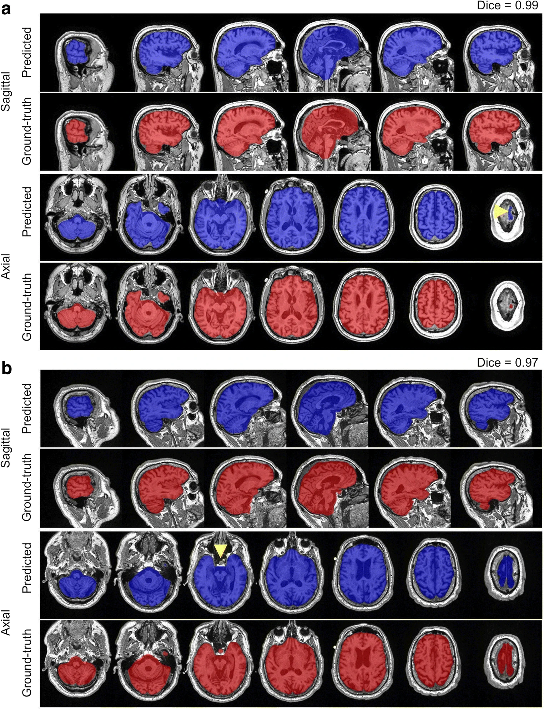
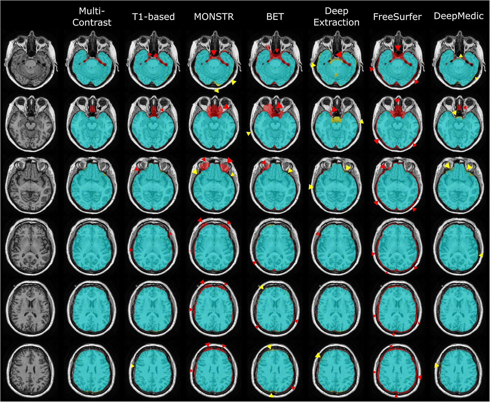
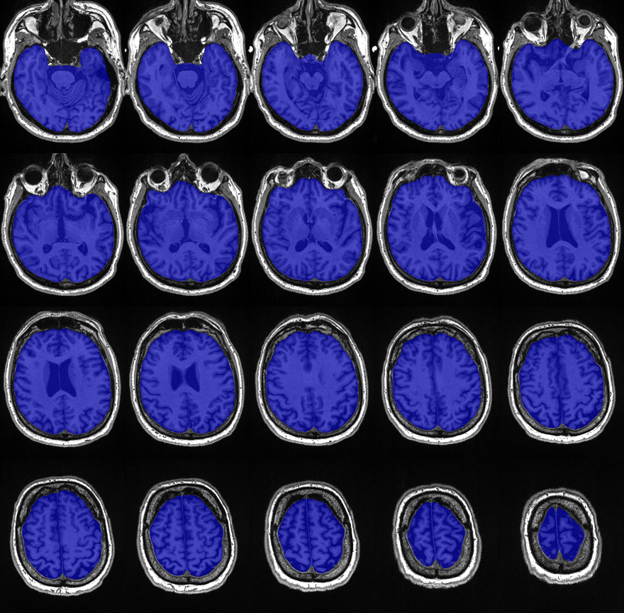

## 1. Overview
- **Toolbox Name**: iCVMapp3r
- **Version**: v1.0.0
- **Documentation**: https://icvmapp3r.readthedocs.io/en/latest/
- **Github**: https://github.com/AICONSlab/iCVMapp3r/tree/master?tab=readme-ov-file
- **Paper**: https://doi.org/10.1007/s12021-021-09510-1
- **Reference**: Ntiri, E. E., Holmes, M. F., Forooshani, P. M., Ramirez, J., Gao, F., Ozzoude, M., … Goubran, M. (2021). Improved segmentation of the intracranial and ventricular volumes in populations with cerebrovascular lesions and atrophy using 3D CNNs. Neuroinformatics, 19, 597–618.
- **Purpose**: CNN-based algorithm for brain extraction (skull-stripping) using MRI images from BrainLab. 

---

## 2. Expected Performance
- **Metrics**: 


- **Qualitative Analysis**: 

Skull stripping segmentation cases with the highest (A) and lowest (B) Dice coefficients from the test set in the coronal and axial views. Blue labels represent predicted segmentations and red represent ground truth delineations. Yellow arrowheads highlight areas of miss-segmentations.



Visual comparison of the ICV segmentation methods in an example subject. Regions highlighted in red or pointed at by red arrows indicate areas that were over segmented. Regions that were under segmented are indicated by yellow arrows.





---

## 3. Installation & Setup
Note: There is a prepare_dataset.py file with helper functions you can use to clean your data.
1. Follow the instructions here to download the Docker image on Singularity: https://icvmapp3r.readthedocs.io/en/latest/docker.html
2. Place the brain scans in their respective folders with the same name as the subject name.
3. Compress the `.nii` t-1 images inside the folder with the command `gzip <subj>`.
4. Create a `results/<dataset_name>/<subj_name>` folder for each subject in the parent directory.
5. Run the following command to get the segmentation:
```bash
singularity exec --nv ./singularity/icvmapper.sif icvmapper seg_icv --t1w /path/to/compressed_sub/<scan.nii.gz> --out /path/result/folder/<result.nii>
```
6. Check the quality and result in the output folders.